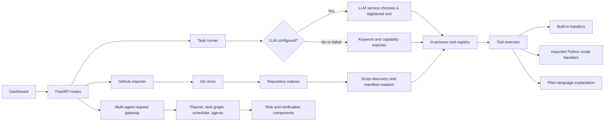

# MATECOS Project Guide

MATECOS (Multi-Agent Tool Ecosystem) is a Python service for registering tools, routing natural-language tasks to tools, importing candidate scripts from public GitHub repositories, and returning readable results. It also contains a broader multi-agent orchestration stack with task graphs, risk checks, verification, and memory components.

This guide describes the code currently in this repository. Some infrastructure interfaces are present as stubs or optional integrations; those distinctions are called out below.

## Contents

- [What the application does](#what-the-application-does)
- [Architecture](#architecture)
- [Repository layout](#repository-layout)
- [Request flows](#request-flows)
- [Built-in tools](#built-in-tools)
- [GitHub import behavior](#github-import-behavior)
- [LLM configuration and behavior](#llm-configuration-and-behavior)
- [HTTP API](#http-api)
- [Run locally](#run-locally)
- [Configuration](#configuration)
- [Persistence and operational notes](#persistence-and-operational-notes)
- [Security notes](#security-notes)
- [Tests and checks](#tests-and-checks)

## What the application does

The project exposes a FastAPI application and a browser dashboard. The main paths are:

1. Submit a task in ordinary language. MATECOS chooses a registered tool, builds that tool's input, runs it, and returns a plain-language explanation plus the structured result.
2. Import a public GitHub repository, branch, or file link. MATECOS clones and indexes the repository, finds Python files that look like command-line scripts, creates tool records for candidates, and registers them.
3. Configure an LLM provider. When configured, the model can help select a tool, describe discovered repository scripts from the README, and explain results.
4. Submit multi-agent requests through the request gateway. This path uses execution and task state models and exposes approval/status endpoints.

## Architecture



### Main layers

- **HTTP/API:** `src/main.py` builds the app, middleware, exception handling, and route registrations. The dashboard is served by `src/api/routes/ui.py` from `src/api/routes/dashboard.html`.
- **Direct task execution:** `src/api/routes/tasks.py` handles tool discovery, candidate matching, LLM-assisted selection, payload extraction, execution, and task history.
- **Tool registry and execution:** `src/tools/registry.py` stores tool manifests and runtime counters. `src/tools/executor.py` dispatches built-in and imported handlers.
- **GitHub import:** `src/api/routes/github_tools.py` coordinates URL normalization, cloning, repository indexing, script discovery, manifest creation, and registration. The adapter code lives in `src/tools/github_adapter/`.
- **LLM service:** `src/services/llm_service.py` supports provider calls, tool selection, repository-script descriptions, and result explanations. The separate agent provider protocol is in `src/agents/llm_interface.py`.
- **Multi-agent flow:** `src/orchestration/` contains planning, task graph, scheduling, and orchestration. `src/agents/` contains the runtime, roles, prompts, and policies.
- **Risk and verification:** `src/risk/` evaluates action risk; `src/verification/` contains result validation and provenance helpers.
- **Memory:** `src/memory/` contains working, episodic, retrieval, retention, and event-store components.
- **Infrastructure:** `src/infrastructure/` contains database models, queue, locks, and telemetry integrations.

## Repository layout

```text
alembic/                  Database migration environment and versions
docker/                   Sandbox image/build files
docs/                     Architecture, development, and API notes
scripts/                  Server, demo, seed, and showcase entry points
src/
  agents/                 Agent runtime, roles, prompts, and LLM protocol
  api/
    dependencies/         Authentication and API dependencies
    routes/               FastAPI route modules and dashboard HTML
    schemas/              Request and response models
  config.py               Application settings
  infrastructure/         Database, Redis queue/locks, telemetry
  memory/                 Working and longer-term memory components
  orchestration/          Planner, DAG, scheduler, state machine
  risk/                   Risk classifiers, engine, policies
  security/               Authorization, isolation, and secrets helpers
  services/               Provider-backed LLM service
  tools/                  Manifests, registry, executor, builtins, adapters
  verification/           Result checks and provenance
tests/
  unit/                   Unit tests by subsystem
  security/               Security tests
  contract/               Schema and API contract tests
  end_to_end/              End-to-end workflow tests
```

Other project files:

- `pyproject.toml` and `uv.lock` define package metadata and dependencies.
- `.env.example` lists example environment settings. Copy it to `.env` for local overrides; `.env` is ignored by Git.
- `run_server.bat`, `run_demo.bat`, `run_showcase.bat`, and `run_tests.bat` are Windows launch helpers.
- `PROJECT.md` is this consolidated project guide. The more focused guides remain under `docs/`.

## Request flows

### Direct task flow

`POST /v1/tasks/run` receives `{ "task": "..." }`. It checks the registered tools and selects one using the configured LLM when available, otherwise using keyword, capability, and description matching. It then creates a payload with the task-specific extractor, runs the handler, asks the LLM service for an explanation (or uses deterministic formatting), and adds the result to in-memory history.

The model may only choose a tool ID present in the offered tool list. Tools over the request's `max_cost` are excluded from LLM selection. If model selection fails, the deterministic selection path is used.

### Multi-agent request flow

`POST /v1/requests` is a separate gateway for creating execution records and exposing status, cancellation, and approval operations. The project includes planners, task graphs, agent runtime, risk checks, and scheduler code. The current request and agent route modules contain in-process stores/stubs where database-backed wiring is not complete; do not assume every request is persisted to PostgreSQL.

## Built-in tools

The GitHub tools route registers these built-ins when the module loads:

| Tool ID | Purpose |
| --- | --- |
| `math.calculator` | Safe arithmetic expression evaluation |
| `web.http_fetch` | Guarded HTTP/HTTPS fetch |
| `data.csv.profile` | CSV shape, missing values, and basic profile |
| `text.json.format` | Validate, format, or minify JSON |
| `text.base64.codec` | Encode/decode Base64 |
| `crypto.hash.gen` | Hash text with a selected digest |
| `util.uuid.gen` | Generate UUID values |
| `text.regex.test` | Test a regular expression against text |
| `util.timestamp.convert` | Convert timestamps and date values |
| `text.word.count` | Count words and text statistics |
| `text.url.parse` | Parse URL components and query values |
| `util.password.gen` | Generate passwords |
| `text.diff.compare` | Compare two text values |
| `text.encode.convert` | Encode/decode supported text formats |
| `data.convert.units` | Convert supported measurement units |

Handlers and manifests are in `src/tools/builtins/`.

## GitHub import behavior

The dashboard's import form accepts a public GitHub repository link. It also accepts GitHub `tree` and `blob` links and uses the linked branch while cloning the repository root. A separately entered branch value takes precedence; if it is blank, the linked branch is used, with `main` as the fallback.

The importer indexes files, searches Python source files for common script entry patterns, and registers candidate scripts. It excludes test, documentation, and example directories from script discovery. If an LLM is configured, it can use the repository README to improve the names, descriptions, and capabilities of discovered scripts. It does not turn arbitrary library functions into callable tools.

Imported script execution currently runs the script with Python in a worker thread and enforces a 30-second timeout. Git cloning also runs in a worker thread, which is required for compatibility with Windows' asyncio event loop. Imported repositories and registered tools are held in memory and need to be imported again after a server restart.

## LLM configuration and behavior

The dashboard's Settings page connects a provider and model. Supported service providers include Gemini, OpenAI-compatible endpoints (including Groq, OpenRouter, Ollama, and custom endpoints), and Anthropic. Provider/model names must be valid for the chosen service.

The dashboard saves this service configuration to `config/llm_config.json` relative to the server's working directory. That file is local runtime configuration and should not be committed. The LLM service can also read provider API keys from environment variables when no saved config is present.

LLM use is optional:

- With a valid enabled configuration, the model can select among registered tools, describe discovered repository scripts, and explain tool results.
- If the LLM is disabled or selection fails, direct task routing falls back to deterministic matching.
- If no model is configured during import, scripts are still discovered with generated default names and descriptions.
- The separate agent provider interface (`src/agents/llm_interface.py`) is used by agent/planner code and is configured through application settings; it is distinct from the dashboard service configuration.

## HTTP API

The local interactive API docs are available at `/docs` when `APP_DEBUG=true`.

### Dashboard and health

| Method | Path | Description |
| --- | --- | --- |
| `GET` | `/` | Dashboard |
| `GET` | `/dashboard` | Dashboard alias |
| `GET` | `/health` | Liveness response |
| `GET` | `/readiness` | Dependency readiness response |
| `GET` | `/metrics` | Metrics text response |

### Tools and tasks

| Method | Path | Description |
| --- | --- | --- |
| `GET` | `/v1/tools` | Search/list tools from the tools API store |
| `GET` | `/v1/tools/{tool_id}` | Read one tool record |
| `POST` | `/v1/tools` | Register a tool manifest (admin scope) |
| `DELETE` | `/v1/tools/{tool_id}/{version}` | Unregister a tool version (admin scope) |
| `GET` | `/v1/tools/{tool_id}/health` | Read tool health snapshot |
| `POST` | `/v1/tasks/run` | Select and run a tool from a natural-language task |
| `POST` | `/v1/tasks/run/{tool_id}` | Run a specific tool |
| `GET` | `/v1/tasks/capabilities` | List tool capabilities |
| `GET` | `/v1/tasks/history` | Read recent in-memory task history |

### GitHub tools

| Method | Path | Description |
| --- | --- | --- |
| `POST` | `/v1/github/import` | Clone, inspect, and register candidate tools from a GitHub link |
| `GET` | `/v1/github/repos` | List repositories imported in this process |
| `DELETE` | `/v1/github/repos/{repo_name}` | Unregister one imported repository and clean its clone |
| `GET` | `/v1/github/tools` | List built-in and imported tools in the GitHub route registry |
| `POST` | `/v1/github/tools/{tool_id}/execute` | Execute a registered tool directly |

### Platform and model settings

| Method | Path | Description |
| --- | --- | --- |
| `POST` | `/v1/platform/batch` | Run up to 10 tasks |
| `GET` | `/v1/platform/stats` | Tool and execution metrics |
| `GET` | `/v1/platform/api-info` | API metadata and examples |
| `POST` | `/v1/platform/snippet` | Generate a client snippet for a tool |
| `GET` | `/v1/platform/categories` | List tool categories |
| `GET` | `/v1/platform/health` | Platform and tool registry status |
| `GET` | `/v1/platform/llm` | Read LLM configuration status (key is masked) |
| `POST` | `/v1/platform/llm` | Save LLM configuration |
| `POST` | `/v1/platform/llm/test` | Test the configured provider |

### Request gateway, agents, and memory

- `/v1/requests`: submit a request, read execution status, cancel, approve, or reject a pending approval.
- `/v1/agents`: list agent status and decision records.
- `/v1/memory`: read exposed memory and audit-event views.

Check the individual route modules or `/docs` for request schemas, query filters, and response fields.

## Run locally

Requirements: Python 3.12 or newer. Git is needed for GitHub imports. PostgreSQL, Redis, and Docker are used by some infrastructure or sandbox paths; the dashboard and direct in-process built-in task flow can start without them, though optional-service startup warnings may appear.

### Windows PowerShell

```powershell
cd C:\path\to\matecos
uv venv --python 3.12
uv pip install -e ".[dev]"
Copy-Item .env.example .env
.\.venv\Scripts\python.exe scripts\run_server.py
```

Open `http://localhost:8000/` for the dashboard. Open `http://localhost:8000/docs` for the interactive API reference while debug mode is enabled.

If a virtual environment already exists, the shorter command is:

```powershell
.\.venv\Scripts\python.exe scripts\run_server.py
```

Other helpers include `scripts/demo_run.py`, `scripts/live_showcase.py`, `scripts/seed_tools.py`, and the root-level `.bat` launchers.

## Configuration

The complete example is in `.env.example`. Common settings:

| Variable | Purpose |
| --- | --- |
| `APP_ENV` | Environment mode; development mode provides a development identity for API dependencies |
| `APP_DEBUG` | Enables reload and `/docs` when true |
| `API_HOST`, `API_PORT` | Server bind address and port |
| `DATABASE_URL` | Async PostgreSQL connection string |
| `REDIS_URL` | Redis connection string for queue/locks and memory integrations |
| `OPENAI_API_KEY`, `ANTHROPIC_API_KEY`, `GEMINI_API_KEY` | Optional provider credentials |
| `DEFAULT_MODEL` | Agent/provider default model setting |
| `GITHUB_TOKEN` | Optional GitHub credential for repository access |
| `SANDBOX_*` | Container image and resource/isolation settings |
| `DEFAULT_MAX_*` | Default orchestration budget limits |

Do not commit `.env`, provider keys, or `config/llm_config.json` containing a secret.

## Persistence and operational notes

- The direct task history, GitHub import list, GitHub route registry, and several request/agent views are process-local dictionaries. Restarting the service clears them.
- `GET /health` is a liveness endpoint. A successful response does not imply that PostgreSQL or Redis is connected; check `/readiness` and startup logs for those dependencies.
- The `/v1/tools` registry API and the `/v1/github/tools` registry are separate in-process stores in the current code. The dashboard's catalog and importer use the GitHub registry endpoints.
- Server logs include startup warnings when optional Redis, telemetry, or database services are unavailable.

## Security notes

- Tool manifests declare risk, filesystem/network policies, resource limits, and input/output schemas. The executor and sandbox components implement additional controls.
- The dashboard GitHub importer currently launches discovered Python scripts as local subprocesses on execution, with a timeout. Treat imported repositories as untrusted. The imported scripts do not automatically run inside the Docker sandbox in this direct-import path.
- Keep `APP_ENV=development` restricted to local development. Production deployments should use real secrets, production authentication configuration, trusted origins, and the intended sandbox/infrastructure setup.
- LLM-generated tool choices are checked against the supplied registered tool IDs. LLM-generated repository metadata can only refer to candidate file paths found in the cloned repository.

## Tests and checks

The test suite is organized by subsystem:

- `tests/unit/`: API, tools, orchestration, agents, risk, memory, verification, and adapter tests.
- `tests/security/`: security and isolation checks.
- `tests/contract/`: response and schema contracts.
- `tests/end_to_end/`: end-to-end workflow coverage.

Run the suite with:

```powershell
.\.venv\Scripts\python.exe -m pytest
```

The project also configures Ruff and mypy in `pyproject.toml`.
